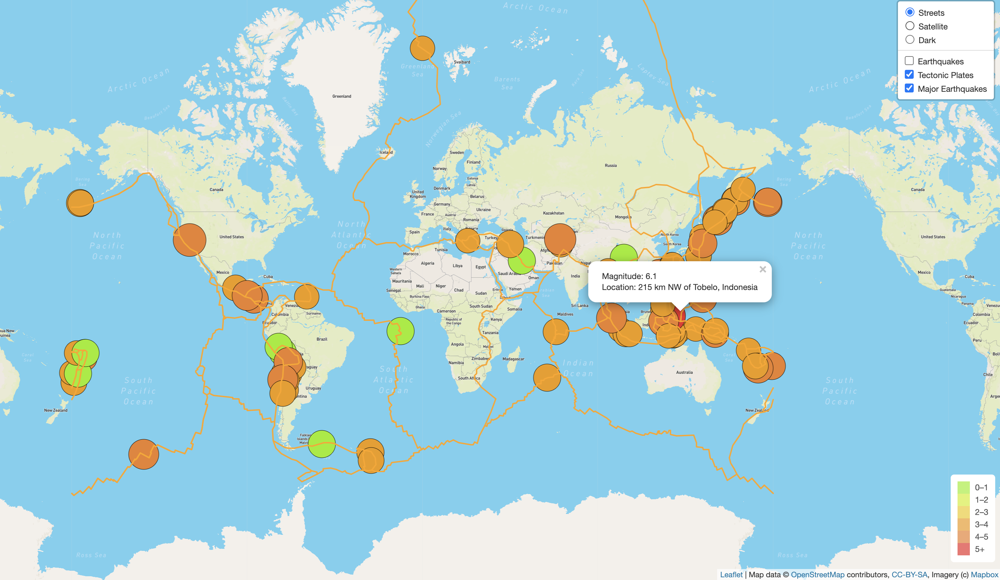
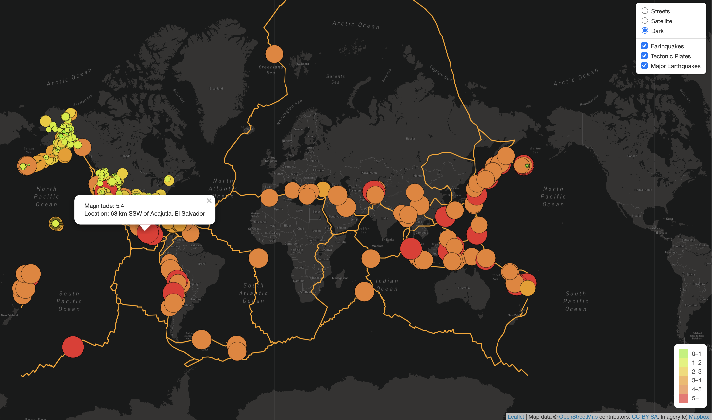

# Mapping_Earthquakes

Mapping Earthquakes using GeoJSON and Leaflet using USGS data.

## Purpose of this study:

The purpose of this study is to create an interactive map using GeoJSON data, that visually shows the differences between the magnitudes of earthquakes all over the world for the last seven days. To complete this project,URL for GeoJSON earthquake data from the USGS website was used along with the geographical coordinates and the magnitudes of earthquakes. Then the data was added to a map.

## Approach:

* JavaScript and the D3.js library was used to retrieve the coordinates and magnitudes of the earthquakes from the GeoJSON data.  
* Leaflet library was used to plot the data on a Mapbox map through an API request and an interactive map was created for the earthquake data.  
* A base map was created with Streets View, Satellite Streets and dark view.  
* The earthquake data was overlaid over the base maps.  
* A blinker was added so that the earthquake locations blinks.

## Results:

### Adding the Tectonic Plate lines.

Once all the earthquake data was mapped it was interesting to visualize the earthquake data in relation to the tectonic plates location on the earth. To achieve this, the tectonic plate lines were overlaid over the base maps.

### Major Earthquakes above 4.5 magnitude all over the world with blinker.

To visualize the major earthquakes with a magnitude above 4.5, a separate layer group was created namely majorEQ and was overlaid over the base maps. A blinker was added in the style info which caused the earthquake locations to blink.

### Additional map.

A third base map namely dark mode was created to visualize the all the above data on that map.

### Data Sources:

* Earthquake GeoJson Data: "https://earthquake.usgs.gov/earthquakes/feed/v1.0/summary/all_week.geojson". 
* Tectonic Plate Data : "https://raw.githubusercontent.com/fraxen/tectonicplates/master/GeoJSON/PB2002_boundaries.json". 
* Major Earthquake Data: "https://earthquake.usgs.gov/earthquakes/feed/v1.0/summary/4.5_week.geojson"

